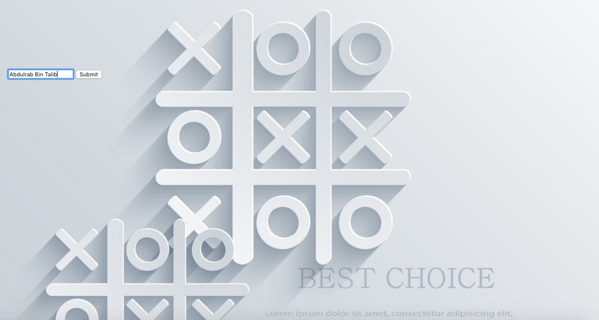
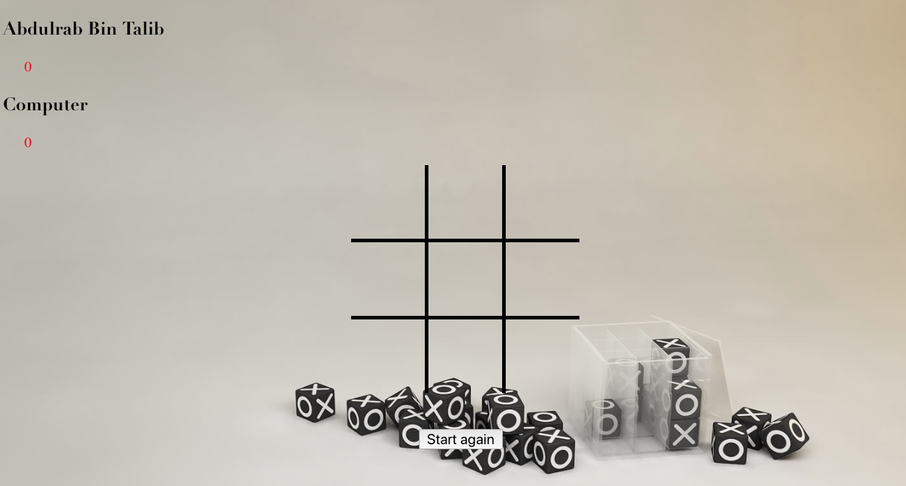

#  Project #1: Tic Tac Toe Game

## Technologies used:

### HTML
Using HTML, I was able to create the foundation of the project that I would later build on using further technologies

### CSS
CSS allowed me to style my content efficiently and give the user a friendly and responsive experience

### Javascript/jQuery
Javascript and jQuery allowed me to create a dynamic project with structured logic to bring the game to life.

## Overview:

is a Javascript game for two players User and computer, X and O, who take turns marking the spaces in a 3×3 grid. The player who succeeds in placing three of their marks in a horizontal, vertical, or diagonal row wins the game.

The following example game is won by the first player, X:

## Features:

* Enter the name of the player home page.
* Button to game page.
* The computer player medium AI.
* Score tracker.
* Button for player again.

## Screenshot

### Homepage

### Game

### Experience the game here: https://abdulrabbt.github.io/Tic-Tac-Toe-Game/
